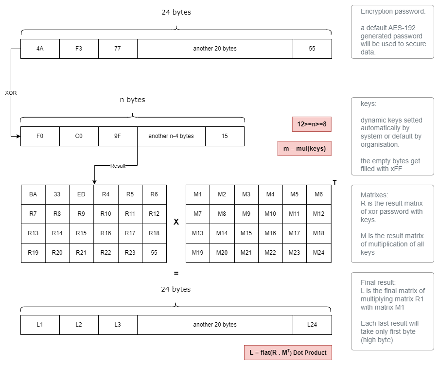

# Secure

## Secure framework
**Secure** is a framework implemented on our **AMS** system to ensure our data security and privacy too. This framework ensure securing data dynamically and also securing the server from potential **injection attacks**. We are going to explain more our implementation and why we have took these measures in first place in the following sections.

### Secure Framework Components

``Secure`` framework devide initially into three files: **aes.py**, **encryption.py** and **sanitization.py**. These files work all together to ensure the integrity, authenticity and security of **personal data**, as well as the security of our server.

We can devide the worklike of this framework into two jobs. encrypting and sanitizating.

In the following section we attend to explain how the encryption works and the reason we choosed to encrypt data with this complex method.

## SecureGate Advanced Encryption Standard

SecureGate (**SG**) AES encryption is a method I created to generate dynamic encrytion key that can be used on our **AMS** system. The encryption goes through two processes; **generating a 24 bytes encryption key** and **encrypting data using AES 192 bits**.

**AES** encryption is very known for how secure is it and how hard is it to get decrypted. but using an automated system such as **AMS** which no human interference, you can never tell how people can exploit and actually get the secure key. That's one of the reasons we implemented **SG AES** but let's leave this one for another time. Let's focus now on what is **SG AES**.


### SG AES Structure

As we mentioned last time, **SG AES** goes initially through a couple of steps, generating and decrypting. so first of all, let's explain how the generation works.

The generation first of all depends on an predefinied password. a password of potentially 24 bytes (random letters) that been set by the admin. This password will go through a process of bitwising and complex multiplications to generate new key.

As we explained in the last chapter, **Implementing NFC on the Attendance Management System**, we suggested a structure for the **NFC** chipset where it holds about ``p`` keys. We didn't dig a lot on that, did we. but now, we are going to explain why are these keys are so important and how we added them to the encryption key.


**Figure** : Suggested NFC Structure


**Keys** : 

``p`` must be less or equal 12 and higher or equal 8 so the generation can be effective and no problem occur. a key **P<sub>i</sub>** where ``i!= 4 and 1=<i=<12``, shall be between x01 and xFF in hex. meaning 255 >= P<sub>i</sub> >= 1 in integer
.

example : **KEY<sub>3</sub>** = 4C ; **KEY<sub>1</sub>** = 12 ;

These key are generated randomly except the forth key ``p == 4`` this key is based on the permission given to the user. if the user get permission ``n = 1 && n == 3 && n == 7`` for example from let's say total of 8 permissions. these permissions will be converted to binary then hex and then from that we put our forth key.

So in this example : **KEY<sub>4</sub>** = hex(int("10100010",2)) <==> **KEY<sub>4</sub>** =  A2

**Generation** : 

The generation goes through three steps

bytewising, making matrixes and finally multiplying matrixes. the following picture showcase the generation process of a encryption key based on **P**  Byte generated keys and a pre-set password too.



**Figure** : **SG-AES**, an Advanced Encryption Standard based on encryption

- **ByteWise** : The process starts with bytewising the actual password with the **P** (or **n** in this figure) generated key. the only first half will be bytewised and the rest will be taken as it is from the password into a new matrix **R**. **Matrix R** is a 24 bytes result matrix from the bytewise where ``R13`` to ``R24`` is identical to ``PASSWORD13`` to ``PASSWORD24``.

    ```python
    def __xor_keys(keys:list):
        full_matrix = np.full((4, 6), 0xFF, dtype=np.uint8)
        keys = keys + [255] * (24-len(keys))
        full_matrix = np.array(keys).reshape((4, 6)).T
        return np.bitwise_xor(DEFAULT_PASSWORD,full_matrix)
    ```

- **Matrix M generation** : **Matrix M** is an 4*6 Matrix of total 24 bytes element generated matrix. This matrix is a result of multiplication of all keys **P**, converted to hex, then each half byte added to this matrix. which a result **MP** (result of multiplication); if **MP** has 12 bytes than we get 24 half bytes. if **MP** has 10 bytes than we get 20 half bytes. We are going to use this matrix in the next step too. this method is used to enhance the security of our encryption.

    ```python
    def __create_multiplication_matrix(keys):
        multiplied = 1
        for i in keys : multiplied = multiplied * i
        # byte by byte convertion 
        byte_array = hex(multiplied).replace("0x","")
        integer_values = [int(byte,16) for byte in byte_array]
        integer_values = integer_values + [255] * (24-len(integer_values))
        full_matrix = np.array(integer_values).reshape((4,6))
        return full_matrix
    ```

- **Last List L** : the list **L** is the result of **dot product** of the result matrix **R** and the transpose of matrix M (**M<sup>T</sup>**). the actual result is a 6*6 matrix but we only took the first 24 element. for each element we take only the first byte of the number to make it work with AES of course but also to make the logic more complex for attackers to exploit it.

    ```python
    def __parse_results(matrix_r,matrix_m):
        results = []
        last_matrix = np.dot(matrix_r,matrix_m)
        for l in last_matrix.flat : 
            results.append(int(hex(int(l)).replace("0x","")[0:2],16))
        return results[:24]
    ```

And that's how we generate the key. pretty simple ain't it? can be done in few lines tho it might seem complex in the first sight.

Anyway, This key will be used to encrypt with actual AES encryption. There's nothing much to tell about AES since it is pretty known.

But let's actually speak about the small technical stuff. Why we choosed to not randomly generate the forth key too? Why using such a random complicated method to encrypt these data?

### Security measures

When I was implementing this system I was taking in consideration every little issue that might happen. such as spoofing and sniffing data, actually attacking the electrical cycle of our system since no one is gonna watch over it (fully automated), and similar attacks and injections that might be harmful to the efficiency of our system and the security of the server holding the actual data too.

So let me explain why I did what I did actually.

First of all why we used an encryptions? We used an encryption technically because we were afraid of the getting sniffed and spoofed.

**What is spoofing and sniffing?** 

Sniffing is the act of stealing data from an actual resource through exploiting the protocol. In our case, both QR and NFC are quite exploited to spoofing and sniffing (especially QR). the information is so important and shall remain confidential. If an attendant doesn't actually like to tell his name to stranger, we have to actually secure it. Anyone who has a phone can scan a QR code; anyone with the proper tools can sniff through the NFC chipset. a [**skimmer**](https://www.bankrate.com/banking/what-is-atm-skimming/) can be used too actually.

Spoofing is the act of altering information, in our case on a qr code or nfc chipset, to get an unauthorized access to a secure system. If we don't encrypt our data it can be easily spoofed and that can actually lead to a lot of security issues. Let’s take, for example, a VIP person in our crowd. We spoof the data with his actual. We can then exploit this data to get unauthorized access to actual **VIP reserved** places.

This doesn't fix the whole solution that's why we are looking to use **NFC** with **VIP** to be able to alter data with new encryption each time the guest come to verify his identity.

Now, we understand why we encrypts data. but, why use dynamic encryption for each time? Well, this is to protect the system from an actual **side-channel attack**. A **side-channel attack** is an attack based on finding important data from technical leaks, for example heat and electricity consumption, my thesis was about implementing deep learning with such an attack so I know how serious it can be. only ``500`` tries can be enough to collect enough traces (leaks) to predict the encryption key. that means an attacker need about **two minutes** alone with the machine to exploit it and get the actual key. So if it never changes, that will be a big issue. The sniffed data will be exposed to leaks all the time.

Finally, let's talk why I have actually chosen to set the forth key to be the same as the set permission. obviously, It was only so If someone try to spoof the permission which is not encrypted actually. The script will actually find that and stop the user from getting unauthorized access. In simple words, the program will check if the permissions on **hex** is the same with the forth key. if It's not, It will return ``False``. In case he changes the forth key too (because he recognized the similarity), the decryption won't work (bad key) which will also return ``False``.

Smart isn't it?

### Summary

The **SG AES** structure is a robust encryption framework designed to secure personal data and ensure security through a password-based key generation. The system crate complex encryption keys that are difficult for attacker to exploit. The use of dynamic encryption enhances security by preventing side-channel attacks, ensuring that keys are also regularly changed to protect against technical leaks. This approach address advanced attacks and common ones such as sniffing and spoofing too, making **SG AES** a reliable solution for protecting our data integrity in our automated